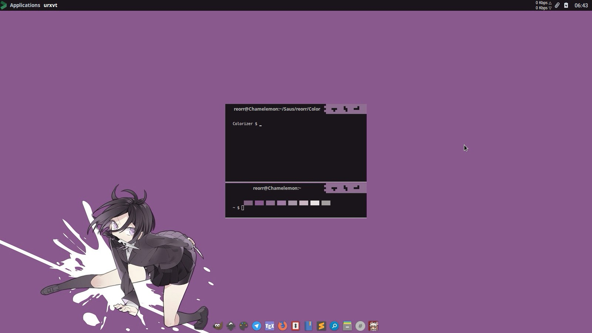

	<h1>warnai</h1>
	
Swiss army theme changer from .Xresources

## Dependencies
- Inkscape (to render assets in gtk theme)

## Usage
<pre>
$ ./warnai
                                    
.-. . .-.  .--.  .----. .-. .-.  .--.  .-.
| |/ \| | / {} \ | {}  }|  `| | / {} \ | |
|  .'.  |/  /\  \| .-. \| |\  |/  /\  \| |
`-'   `-'`-'  `-'`-' `-'`-' `-'`-'  `-'`-'                                   

Usage : warnai [options #parameter]

Avaible options
--wal     | -w    Generate color from pywal cache
--xcolor  | -xc   Generate color from custom .Xresources file
--gtk     | -g    Choose gtk theme from list [ fantome ]
--xfwm    | -xf   Choose xfwm4 theme from list [ pastel | black-paha | one_new | nest1 | diamondo | wendows | tetris | ribbon | just-title-bar ]
--openbox | -ob   Choose openbox theme from list [ pelangi | tricky | large-tb | mek-oes ]
--tint2   | -t    Choose tint2 theme from list [ chromeos | chromeos-tinted | chromeos-pelangi | slim-text-dark | slim-text-tinted | slim-text-tinted-dark | floaty-rounded | floaty ]
--help    | -h    Show help
</pre>

To generate gtk theme and xfwm4 theme, use:
<pre>
$ ./warnai --wal --gtk fantome --xfwm [ pastel | black-paha | one_new | nest1 | diamondo | wendows ]
</pre>
To generate only xfwm4 theme, use:
<pre>
$ ./warnai --wal --xfwm [ pastel | black-paha | one_new | nest1 | diamondo | wendows ]
</pre>
remember to choose only one xfwm theme, and not using bracket
example:
<pre>
$ ./warnai --wal --xfwm pastel
</pre>
or

<pre>
$ ./warnai --wal --xfwm diamondo
</pre>

## Preview

## Credits
- inspired by obtgen by [Fikri Omar](https://github.com/fikriomar16/obtgen/)
- xfwm theme from [Faat Fuut](https://github.com/Nztux/fuut-xfwm.xfce-theme-Collections)
- fantome gtk theme from [Adhi Pambudi](https://github.com/addy-dclxvi/gtk-theme-collections/)
- diamondo xfwm theme inspired by [Circela xfwm theme ](https://github.com/addy-dclxvi/xfwm4-theme-collections)
- xfwm theme from [Wotalim](https://github.com/wotalim/sora-aoi)
- openbox theme pelangi by [Adhi Pambudi](https://github.com/addy-dclxvi/openbox-theme-collections)