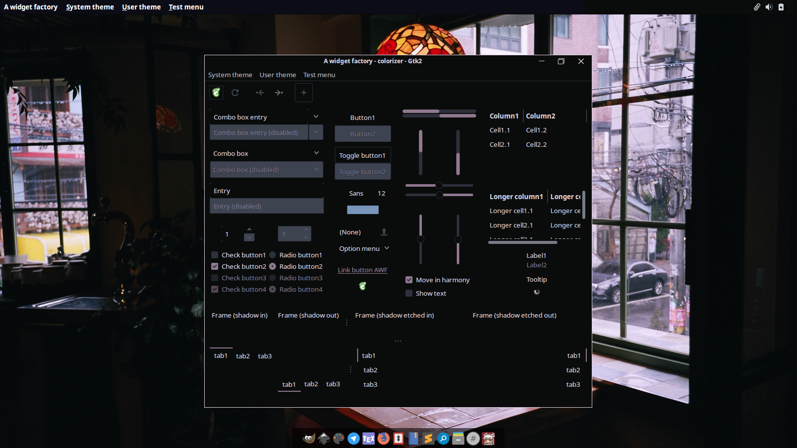
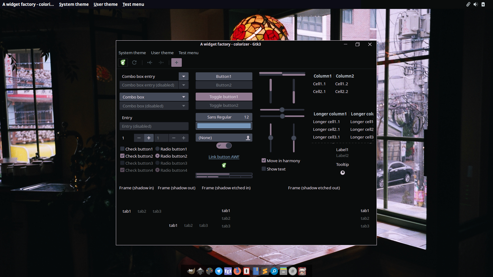
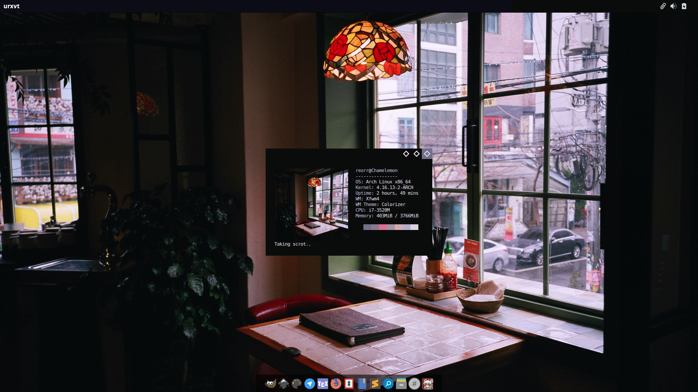
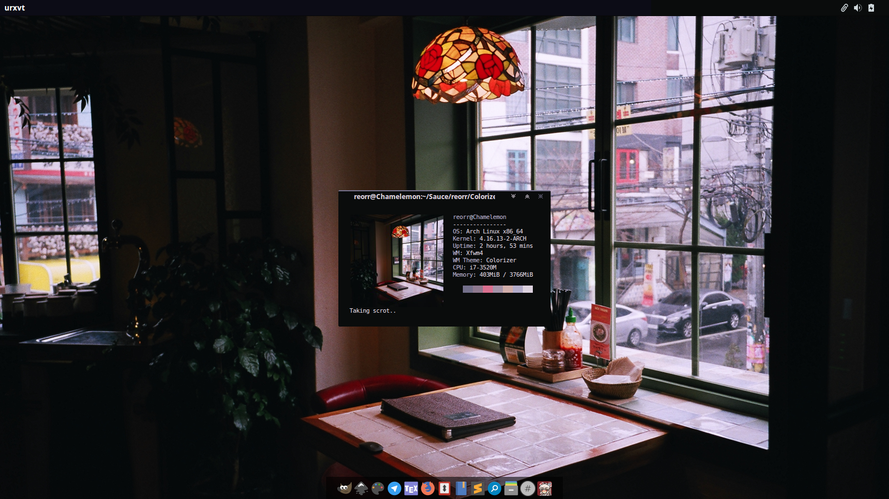
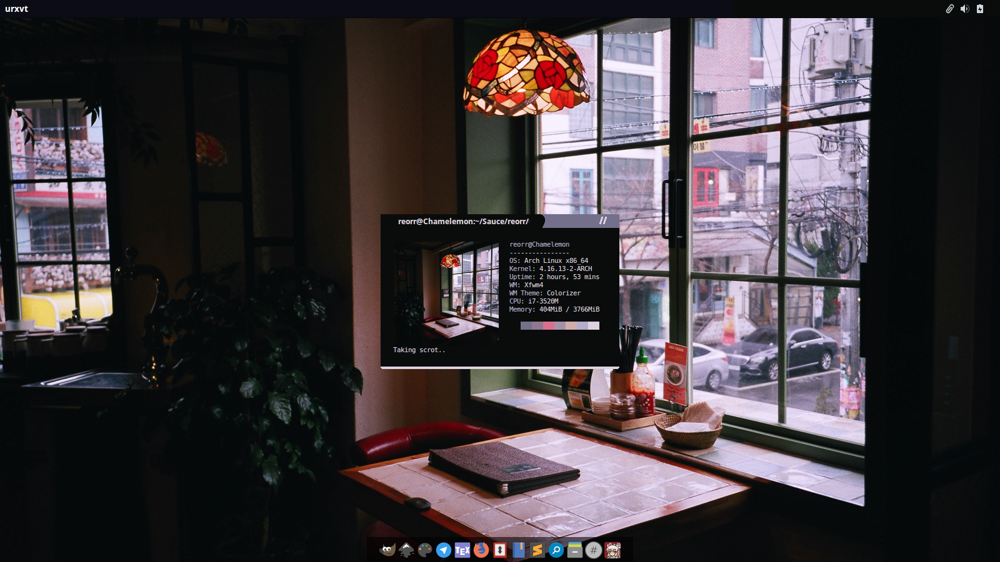
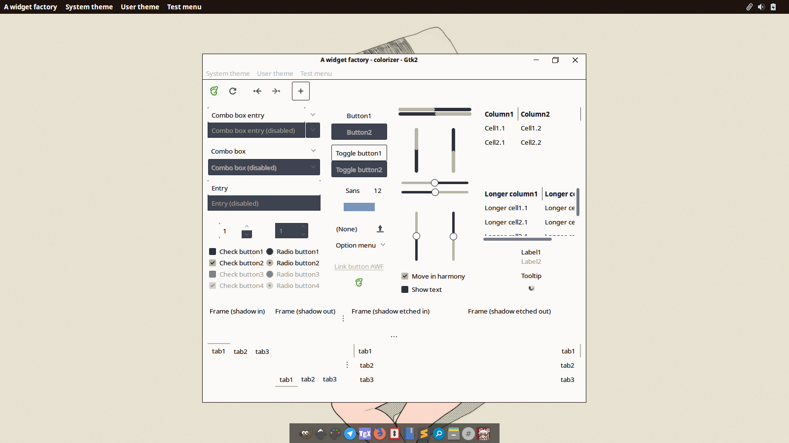
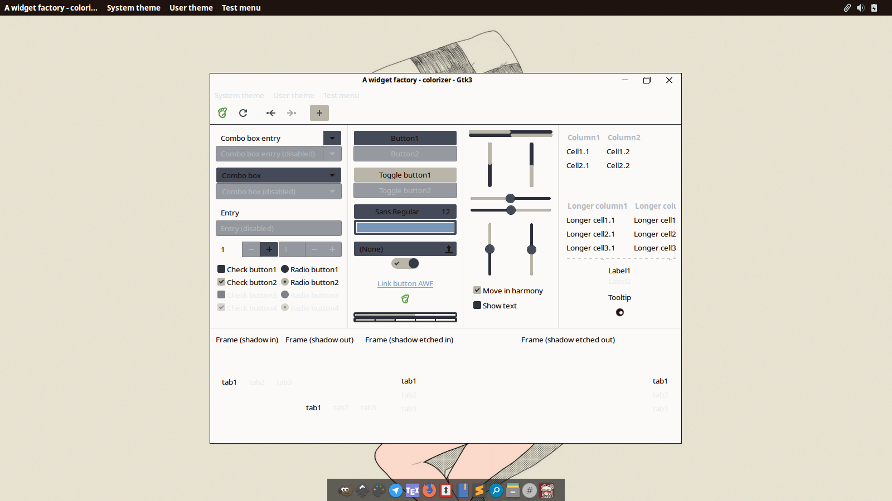
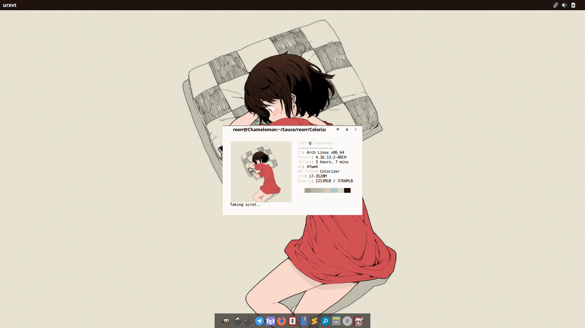

# Colorizer
Colorize gtk and xfwm theme from .Xresources

## Dependencies
- Inkscape (to render assets in gtk theme)

## Usage
<pre>
$ ./colorizer.sh
                                    
 _____     _         _             
|     |___| |___ ___|_|___ ___ ___ 
|   --| . | | . |  _| |- _| -_|  _|
|_____|___|_|___|_| |_|___|___|_|  
                                   

Usage : colorizer [options #optional]

Avaible options
--wal       Generate color from pywal cache
--gtk       Choose gtk theme from list [ fantome ]
--xfwm      Choose xfwm4 theme from list [ pastel | black-paha | one_new | nest1 | diamondo | wendows ]
--help      Show help
</pre>

To generate gtk theme and xfwm4 theme, use:
<pre>
$ ./colorizer.sh --wal --gtk fantome --xfwm [ pastel | black-paha | one_new | nest1 | diamondo | wendows ]
</pre>
To generate only xfwm4 theme, use:
<pre>
$ ./colorizer.sh --wal --xfwm [ pastel | black-paha | one_new | nest1 | diamondo | wendows ]
</pre>
remember to choose only one xfwm theme, and not using bracket
example:
<pre>
$ ./colorizer.sh --wal --xfwm pastel
</pre>
or

<pre>
$ ./colorizer.sh --wal --xfwm diamondo
</pre>

## Gallery

